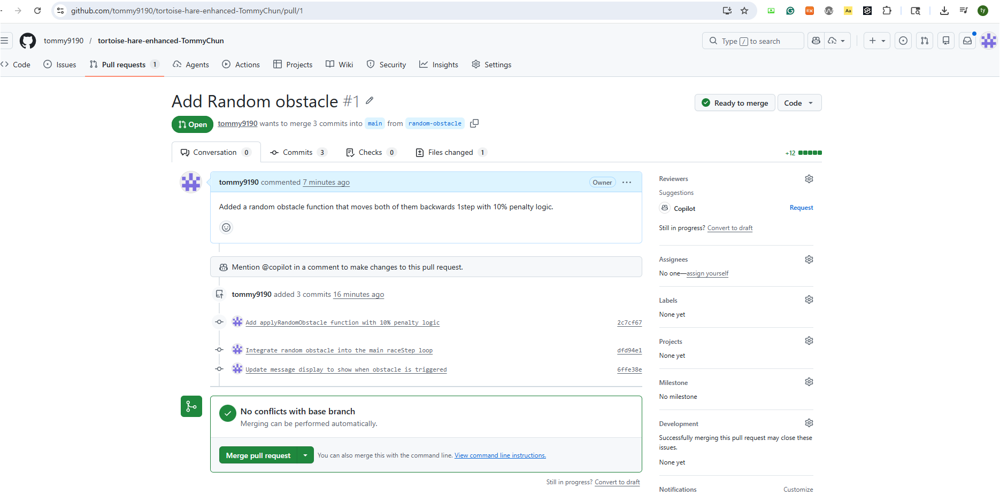

## What feature did you implement?

I implemented "Option B - Add Random Obstacle." I created a new function called applyRandomObstacle() that runs every turn during the race. Using Math.random() and conditional logic, I added a 10% chance for both the tortoise and the hare to trip on an obstacle and move backward by 1 step. I also updated the game's message display to notify the user when this random event happens.

## What was the most difficult bug or issue?

The most challenging part was deciding exactly where to place the new obstacle logic within the main game loop (raceStep()). If I subtracted a step at the wrong time, the animals could potentially fall off the track (going below position 1). I resolved this by making sure to call applyRandomObstacle() before the clampPosition() function. This ensured that even if they moved backward, their positions were always safely corrected to stay within the track limits right after.

## Paste your 3 best commit messages

1. Add applyRandomObstacle function with 10% penalty logic
2. Integrate random obstacle into the main raceStep loop
3. Update message display to show when obstacle is triggered

## Add a screenshot of your Pull Request page

